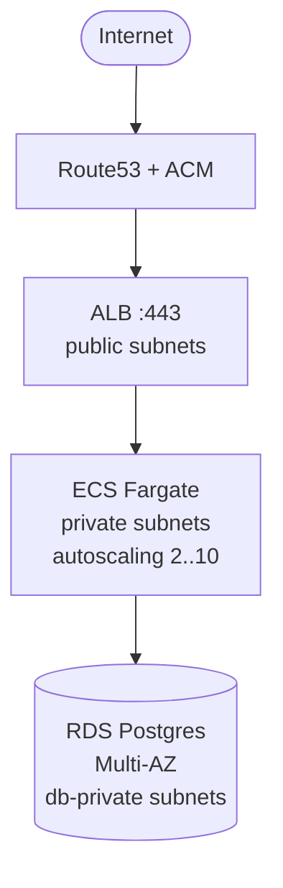

# terraform-aws-web-stack

Terraform modules for a 3-tier containerized web stack on AWS. This is the
shape I've been running at Socialnet for several small/medium production
services (as DevOps team lead). Pulled out here so the next account I
bootstrap doesn't start from a blank `main.tf`.



Documentación en español: [README.es.md](./README.es.md)

## Modules

| module              | purpose                                                               |
|---------------------|-----------------------------------------------------------------------|
| `modules/vpc`       | VPC, 3 subnet tiers (public / private / db-private), NAT (1 or 1 per AZ) |
| `modules/alb`       | ALB + HTTPS listener, ACM validation, R53 alias, optional WAF         |
| `modules/ecs-service` | Fargate task def, service, IAM roles, log group, target group, autoscaling |
| `modules/rds`       | Postgres instance, parameter group, subnet group, KMS-encrypted, Multi-AZ |

Each module is small and composable. `examples/simple` and
`examples/production` show how they plug together.

## Quickstart — `examples/simple`

```bash
cd examples/simple
cp terraform.tfvars.example terraform.tfvars   # edit to your account
terraform init
terraform validate       # syntax check only, no AWS needed
terraform plan           # requires AWS creds
terraform apply
```

The `simple` example spins up a **single-AZ NAT dev stack** (~$50/mo at
list price including NAT) — the minimum shape to see the modules talking
to each other. Use `examples/production` for Multi-AZ NATs + Multi-AZ RDS.

## Design choices

### 1-NAT vs NAT-per-AZ (`nat_mode`)

The VPC module takes `nat_mode = "single" | "per_az"`. The "one NAT per AZ
for HA" advice is correct for prod, but gets copy-pasted onto dev and
staging VPCs where a 20-minute rebuild is fine. Each extra NAT is ~$32/mo
plus data. In practice I use `per_az` for prod and `single` for
everything else.

### Private subnets for RDS are separate from app private

`db-private` subnets are separate from `private`. RDS security group
only allows ingress from the ECS tasks' security group, nothing else.
This is the one setting that most often gets left too permissive.

### ECS Fargate, not EC2

Fargate removes the "who patches the AMI" question. For the scale this
module targets (< 50 tasks), the premium Fargate charges is worth the
operational savings.

### No hardcoded counts of AZs

The VPC module picks the first `az_count` AZs from
`data.aws_availability_zones.available`. No assumption that you're in
us-east-1 with `a/b/c`. Works in `sa-east-1`, `eu-central-1`, etc.

## Validation

```bash
# Every example must pass
(cd examples/simple && terraform init -backend=false && terraform validate)
(cd examples/production && terraform init -backend=false && terraform validate)

# Security scan (optional, uses tfsec)
tfsec .
```

See `.github/workflows/validate.yml` for CI.

## Scope

Things this repo does not include, on purpose:

- App code — this is infra, your app is yours.
- CI/CD pipeline — use GitHub Actions, CodePipeline, Atlantis, whatever fits.
- Full observability — CloudWatch is wired in; Datadog/Grafana is a bolt-on.
- Cost dashboards — I have [`aws-cost-optimizer-cli`](https://github.com/sarteta/aws-cost-optimizer-cli)
  for that side of things.

## Versioning

Semantic versioning. Breaking changes bump major.
Tags are git tags on `main`. Use:

```hcl
module "web_stack_vpc" {
  source = "github.com/sarteta/terraform-aws-web-stack//modules/vpc?ref=v0.1.0"
  # ...
}
```

## License

MIT © 2026 Santiago Arteta
